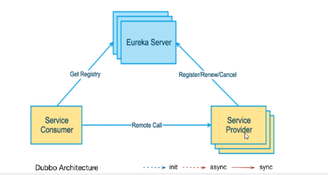
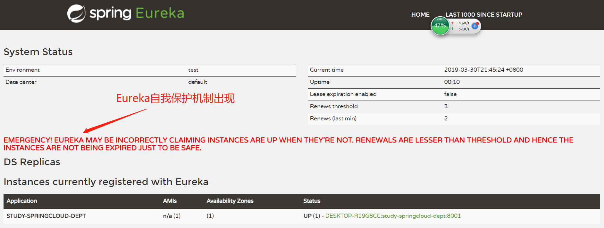
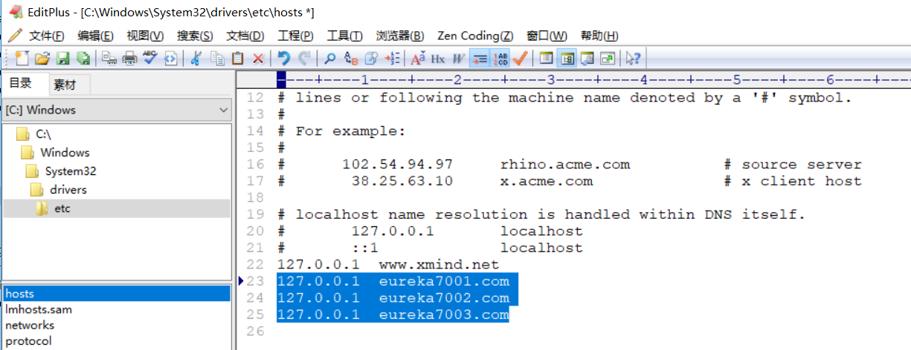
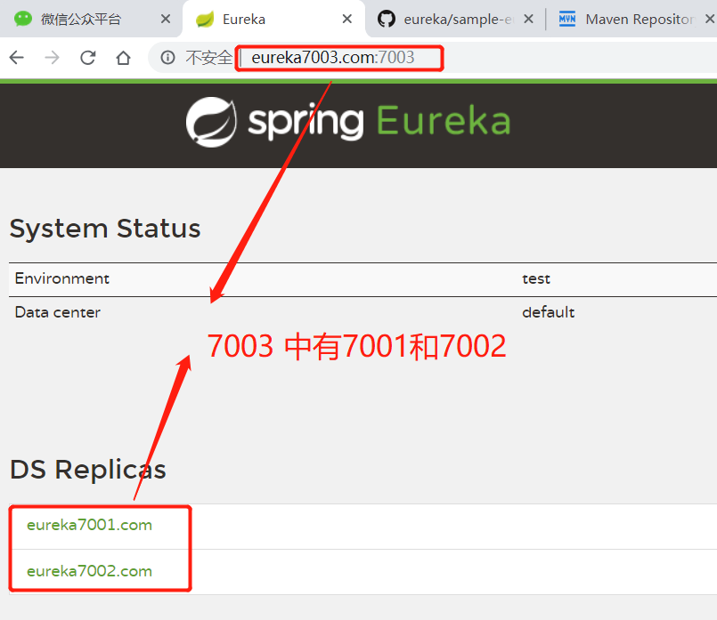
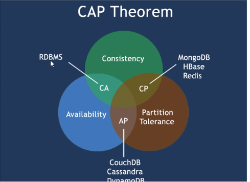

# Spring Cloud学习笔记

CSDN博客地址：https://blog.csdn.net/qq_18547653/article/details/88934787
博客能看到图片，效果比较好


## 一、工程环境搭建

spring cloud版本：Dalston.SR1

spring boot版本：1.5.19.RELEASE

### 1、父工程搭建

- 新建springcloud-study 父工程

  pom文件

```xml
<?xml version="1.0" encoding="UTF-8"?>
<project xmlns="http://maven.apache.org/POM/4.0.0" xmlns:xsi="http://www.w3.org/2001/XMLSchema-instance"
         xsi:schemaLocation="http://maven.apache.org/POM/4.0.0 http://maven.apache.org/xsd/maven-4.0.0.xsd">
    <modelVersion>4.0.0</modelVersion>
    <groupId>com.gxs.springcloud</groupId>
    <artifactId>springcloud-study</artifactId>
    <version>1.0-SNAPSHOT</version>
    <packaging>pom</packaging>
    <properties>
        <project.build.sourceEncoding>UTF-8</project.build.sourceEncoding>
        <maven.compiler.source>1.8</maven.compiler.source>
        <maven.compiler.target>1.8</maven.compiler.target>
        <junit.version>4.12</junit.version>
        <log4j.version>1.2.17</log4j.version>
        <druid.version>1.1.10</druid.version>
        <spring-boot.version>1.5.19.RELEASE</spring-boot.version>
        <spring-cloud.version>Dalston.SR1</spring-cloud.version>
        <mysql-connector.version>5.1.47</mysql-connector.version>
        <mybatis-starter.version>1.3.3</mybatis-starter.version>
        <logback.version>1.2.3</logback.version>
        <lombok.version>1.18.6</lombok.version>
    </properties>

    <dependencyManagement>
        <dependencies>
            <dependency>
                <groupId>org.springframework.cloud</groupId>
                <artifactId>spring-cloud-dependencies</artifactId>
                <version>${spring-cloud.version}</version>
                <type>pom</type>
                <scope>import</scope>
            </dependency>
            <dependency>
                <groupId>org.springframework.boot</groupId>
                <artifactId>spring-boot-dependencies</artifactId>
                <version>${spring-boot.version}</version>
                <type>pom</type>
                <scope>import</scope>
            </dependency>
            <dependency>
                <groupId>mysql</groupId>
                <artifactId>mysql-connector-java</artifactId>
                <version>${mysql-connector.version}</version>
            </dependency>
            <dependency>
                <groupId>com.alibaba</groupId>
                <artifactId>druid</artifactId>
                <version>${druid.version}</version>
            </dependency>
            <dependency>
                <groupId>org.mybatis.spring.boot</groupId>
                <artifactId>mybatis-spring-boot-starter</artifactId>
                <version>${mybatis-starter.version}</version>
            </dependency>
            <dependency>
                <groupId>log4j</groupId>
                <artifactId>log4j</artifactId>
                <version>${log4j.version}</version>
            </dependency>
            <dependency>
                <groupId>ch.qos.logback</groupId>
                <artifactId>logback-core</artifactId>
                <version>${logback.version}</version>
            </dependency>
            <dependency>
                <groupId>junit</groupId>
                <artifactId>junit</artifactId>
                <version>${junit.version}</version>
                <scope>test</scope>
            </dependency>
        </dependencies>
    </dependencyManagement>
</project>
```

### 2 、构建公共子模块 springcloud-study-api

pom文件

```xml
<?xml version="1.0" encoding="UTF-8"?>
<project xmlns="http://maven.apache.org/POM/4.0.0" xmlns:xsi="http://www.w3.org/2001/XMLSchema-instance"
         xsi:schemaLocation="http://maven.apache.org/POM/4.0.0 http://maven.apache.org/xsd/maven-4.0.0.xsd">

    <modelVersion>4.0.0</modelVersion>
    <parent>
        <groupId>com.gxs.springcloud</groupId>
        <artifactId>springcloud-study</artifactId>
        <version>1.0-SNAPSHOT</version>
    </parent>

    <artifactId>springcloud-study-api</artifactId>

</project>
```

### 3、构建服务提供者 springcloud-study-provider-dept-8001

pom文件

```xml
<?xml version="1.0" encoding="UTF-8"?>
<project xmlns="http://maven.apache.org/POM/4.0.0" xmlns:xsi="http://www.w3.org/2001/XMLSchema-instance"
         xsi:schemaLocation="http://maven.apache.org/POM/4.0.0 http://maven.apache.org/xsd/maven-4.0.0.xsd">

    <modelVersion>4.0.0</modelVersion>
    <parent>
        <groupId>com.gxs.springcloud</groupId>
        <artifactId>springcloud-study</artifactId>
        <version>1.0-SNAPSHOT</version>
    </parent>

    <artifactId>springcloud-study-provider-dept-8001</artifactId>

    <dependencies>
        <dependency>
            <groupId>com.gxs.springcloud</groupId>
            <artifactId>springcloud-study-api</artifactId>
            <version>${project.version}</version>
        </dependency>
        <dependency>
            <groupId>junit</groupId>
            <artifactId>junit</artifactId>
        </dependency>
        <dependency>
            <groupId>mysql</groupId>
            <artifactId>mysql-connector-java</artifactId>
        </dependency>
        <dependency>
            <groupId>com.alibaba</groupId>
            <artifactId>druid</artifactId>
        </dependency>
        <dependency>
            <groupId>ch.qos.logback</groupId>
            <artifactId>logback-core</artifactId>
        </dependency>
        <dependency>
            <groupId>org.mybatis.spring.boot</groupId>
            <artifactId>mybatis-spring-boot-starter</artifactId>
        </dependency>
        <dependency>
            <groupId>org.springframework.boot</groupId>
            <artifactId>spring-boot-starter-jetty</artifactId>
        </dependency>
        <dependency>
            <groupId>org.springframework.boot</groupId>
            <artifactId>spring-boot-starter-web</artifactId>
        </dependency>
        <dependency>
            <groupId>org.springframework.boot</groupId>
            <artifactId>spring-boot-starter-test</artifactId>
        </dependency>
        <!--热部署 修改后立即生效-->
        <dependency>
            <groupId>org.springframework</groupId>
            <artifactId>springloaded</artifactId>
        </dependency>
        <dependency>
            <groupId>org.springframework.boot</groupId>
            <artifactId>spring-boot-devtools</artifactId>
        </dependency>

    </dependencies>

</project>
```

yml文件配置

```yml
#配置服务器信息
server:
  port: 8001
  #context-path: /study 配置根目录


#数据库信息配置
spring:
  application:
    name: study-springcloud-dept  #应用名称
  datasource:
    url: jdbc:mysql://localhost:3306/study?useUnicode=true&characterEncoding=UTF-8&serverTimezone=UTC&verifyServerCertificate=false&useSSL=false
    username: root
    password: root
    driver-class-name: com.mysql.jdbc.Driver
    type: com.alibaba.druid.pool.DruidDataSource

#druid连接池配置
    initialSize: 5
    minIdle: 5
    maxActive: 20
    maxWait: 60000
    timeBetweenEvictionRunsMillis: 60000
    minEvictableIdleTimeMillis: 300000
    validationQuery: SELECT 1 FROM DUAL
    testWhileIdle: true
    testOnBorrow: false
    testOnReturn: false
    poolPreparedStatements: true
    # 配置监控统计拦截的filters,去掉监控界面sql无法统计，‘wall’用于防火墙
    filters: stat,wall,log4j
    maxPoolPreparedStatementPerConnectionSize: 20
    userGlobalDataSourceStat: true
    connectionProperties: druid.stat.mergeSql=true;druid.stat.slowSqlMillis=500

#Mybatis配置
mybatis:
  mapper-locations: classpath:mapper/*.xml
  type-aliases-package: com.gxs.springcloud.entities
  configuration:
    map-underscore-to-camel-case: true #开启驼峰命名
    cache-enabled: true #开启二级缓存
```

### 4、构建服务消费者 springcloud-study-consumer-dept-80

pom文件配置

```xml
<?xml version="1.0" encoding="UTF-8"?>
<project xmlns="http://maven.apache.org/POM/4.0.0" xmlns:xsi="http://www.w3.org/2001/XMLSchema-instance"
         xsi:schemaLocation="http://maven.apache.org/POM/4.0.0 http://maven.apache.org/xsd/maven-4.0.0.xsd">

    <modelVersion>4.0.0</modelVersion>
    <parent>
        <groupId>com.gxs.springcloud</groupId>
        <artifactId>spring-cloud-study</artifactId>
        <version>1.0-SNAPSHOT</version>
    </parent>

    <artifactId>springcloud-study-consumer-dept-80</artifactId>

    <dependencies>
        <dependency>
            <groupId>com.gxs.springcloud</groupId>
            <artifactId>springcloud-study-api</artifactId>
            <version>${project.version}</version>
        </dependency>
        <dependency>
            <groupId>junit</groupId>
            <artifactId>junit</artifactId>
        </dependency>

        <dependency>
            <groupId>ch.qos.logback</groupId>
            <artifactId>logback-core</artifactId>
        </dependency>

        <dependency>
            <groupId>org.springframework.boot</groupId>
            <artifactId>spring-boot-starter-jetty</artifactId>
        </dependency>
        <dependency>
            <groupId>org.springframework.boot</groupId>
            <artifactId>spring-boot-starter-web</artifactId>
        </dependency>
        <dependency>
            <groupId>org.springframework.boot</groupId>
            <artifactId>spring-boot-starter-test</artifactId>
        </dependency>
        <!--热部署 修改后立即生效-->
        <dependency>
            <groupId>org.springframework</groupId>
            <artifactId>springloaded</artifactId>
        </dependency>
        <dependency>
            <groupId>org.springframework.boot</groupId>
            <artifactId>spring-boot-devtools</artifactId>
        </dependency>

    </dependencies>

</project>
```

yml配置

```yml
server:
  port: 80
```

主启动类

```java
@SpringBootApplication
public class DeptConsumer80App {
    public static void main(String[] args) {
        SpringApplication.run(DeptConsumer80App.class,args);
    }
}
```

# 二、Eureka配置



- 新建springcloud-study-euraka-7001工程，导入相关依赖

pom文件配置

```xml
<?xml version="1.0" encoding="UTF-8"?>
<project xmlns="http://maven.apache.org/POM/4.0.0" xmlns:xsi="http://www.w3.org/2001/XMLSchema-instance"
         xsi:schemaLocation="http://maven.apache.org/POM/4.0.0 http://maven.apache.org/xsd/maven-4.0.0.xsd">

    <modelVersion>4.0.0</modelVersion>
    <parent>
        <groupId>com.gxs.springcloud</groupId>
        <artifactId>spring-cloud-study</artifactId>
        <version>1.0-SNAPSHOT</version>
    </parent>

    <artifactId>springcloud-study-euraka-7001</artifactId>

    <dependencies>
        <!--eureka-server 服务端-->
        <dependency>
            <groupId>org.springframework.cloud</groupId>
            <artifactId>spring-cloud-starter-eureka-server</artifactId>
        </dependency>
        <!--热部署 修改后立即生效-->
        <dependency>
            <groupId>org.springframework</groupId>
            <artifactId>springloaded</artifactId>
        </dependency>
        <dependency>
            <groupId>org.springframework.boot</groupId>
            <artifactId>spring-boot-devtools</artifactId>
        </dependency>

    </dependencies>

</project>
```

yml文件配置

```yml
server:
  port: 7001
eureka:
  instance:
    hostname: localhost #eureka服务端的实例名称
  client:
    register-with-eureka: false #false表示不向注册中心注册自己
    fetch-registry: false #false 表示自己就是注册中心，职责就是维护服务实例，并不需要去检索服务
    service-url:
      defaultZone: http://${eureka.instance.hostname}:${server.port}/eureka/ #设置与eureka server 交互的地址查询服务和注册服务都需要依赖的地址
```

## 1、将服务注册进Eureka

- 8001provider服务中添加配置

```xml
<!--将微服务provider注册进eureka-->
        <dependency>
            <groupId>org.springframework.cloud</groupId>
            <artifactId>spring-cloud-starter-eureka</artifactId>
        </dependency>

        <dependency>
            <groupId>org.springframework.cloud</groupId>
            <artifactId>spring-cloud-starter-config</artifactId>
        </dependency>
```

- 修改8001的yml配置

```yml
#客户端注册进eureka服务列表
eureka:
  client:
    service-url:
      defaultZone: http://localhost:7001/eureka
```

- 8001 启动类增加@EnableEurekaClient注解

```java
@SpringBootApplication
@EnableEurekaClient
public class DeptProvider8001App {

    public static void main(String[] args) {
        SpringApplication.run(DeptProvider8001App.class,args);
    }
}
```

- 注册成功，在7001的Eureka服务站中会显示


## 2、actuator与注册微服务信息完善

**actuator：在springboot中主管监控和配置**

- 主机名称、服务名称修改

  1、修改8001的yml配置

  ```yml
  eureka:
    client:
      service-url:
        defaultZone: http://localhost:7001/eureka
     #服务实例名称修改
    instance:
      instance-id: study-springcloud-dept8001
  ```

- 访问信息有ip信息提示

  修改8001yml配置

  ```yml
  #客户端注册进eureka服务列表
  eureka:
    client:
      service-url:
        defaultZone: http://localhost:7001/eureka
    instance:
      #服务实例名称修改
      instance-id: study-springcloud-dept8001
      #访问路径显示IP地址
      prefer-ip-address: true
  ```

- 微服务info内容详细信息

  1、修改8001的pom文件，增加actuator的配置

  ```xml
  <!--actuator监控自信息完善-->
  <dependency>
      <groupId>org.springframework.boot</groupId>
      <artifactId>spring-boot-starter-actuator</artifactId>
  </dependency>
  ```

  2、父工程pom文件修改，增加build信息

  ```xml
  <build>
          <!--finalName 父工程名称-->
          <finalName>spring-cloud-study</finalName>
          <resources>
              <resource>
                  <directory>src/main/resources</directory>
                  <!--过滤开启-->
                  <filtering>true</filtering>
              </resource>
  
          </resources>
         <!--增加插件-->
          <plugins>
              <plugin>
                  <groupId>org.apache.maven.plugins</groupId>
                  <artifactId>maven-resources-plugin</artifactId>
                  <!--配置插件解析-->
                  <configuration>
                      <delimiters>
                          <delimit>$</delimit>
                      </delimiters>
                  </configuration>
              </plugin>
          </plugins>
      </build>
  ```

  3、修改8001的yml，增加info信息

  ```yml
  info:
    app.name: study-springcloud-micoservices
    company.name: www.gxs.com
    build.artifactId: $project.artifactId$
    build.version: $project.version$
  ```

  

## 3、Eureka自我保护机制



- Netflix在设置Eureka时，遵循AP原则

- 某时刻某一微服务不可用时，eureka不会立刻清理，依旧会对改微服务的信息进行保存。服务失去心跳、名称变更、网络拥堵

- **自我保护机制：**应对网络异常的安全措施

  默认情况下，如果EurekaServer在一定时间内没有接收到某个微服务实例的心跳，EurekaServer将会注销实例（默认90秒）。但是当网络分区故障发生时，微服务与EurekaServer之间无法正常通信，以上行为可能变得非常危险——因为微服务本身其实是健康的，==此时本不应该注销这个服务==。Eureka通过“自我保护模式”来解决这个问题——当EurekaServer节点再短时间内丢失过多客户端时（可能发生网络故障），那么这个节点就会进入自我保护模式。一旦进去该模式，EurekaServer就会保护服务注册表中的信息，不再删除服务注册表中的数据（也即不会注销任何微服务）。当网络故障恢复后，改EurekaServer节点会自动退出自我保护模式。

  ==宁可保护错误的注册信息，也不盲目注销任何可能健康的微服务实例==

  #### 禁用自我保护机制

  可以使用eureka.server.enable-self-preservation=false

## 4、Eureka服务发现

   对于注册进eureka里面的服务，可以通过服务发现获得该服务的信息

  ==供消费者调用==

  ##### 1、添加服务发现接口

  在8001工程的Controller类中增加DiscoveryClient

  ```java
  @Autowired
  private DiscoveryClient discoveryClient;
  ```

  ##### 2、增加自己服务描述的接口

  ```java
  @RequestMapping(value = "/dept/discovery",method = RequestMethod.GET)
  public Object discovery(){
      List<String> list = discoveryClient.getServices();
      List<ServiceInstance> instances = discoveryClient.getInstances("STUDY-SPRINGCLOUD-DEPT");
  
      for (ServiceInstance element :instances){
          System.out.println(element.getServiceId());
          System.out.println(element.getHost());
          System.out.println(element.getPort());
          System.out.println(element.getUri());
      }
      return this.discoveryClient;
  
  }
  ```

  ##### 3、8001主启动类中增加 @@EnableDiscoveryClient注解

  ##### 4、启动，调用<http://localhost:8001/dept/discovery>

  8001需要等待注入一段时间，注入进server

  ##### 5、在80消费端中增加相应调用

  ```java
  @RequestMapping(value = "/consumer/dept/discovery")
  public Object discovery(){
      return  restTemplate.getForObject(
              REST_URL_PREFIX+"/dept/discovery",
              Object.class);
  }
  ```

## 5、Eureka集群配置


  ### 1、新建7002、7003Eureka服务项目

复制7001的pom、yml文件

  ### 2、修改域名映射，修改host文件

==必须修改，否则不成功==



### 3、台Eureka的yml配置


修改7001、7002、7003对应的yml配置

```yml
service-url:
  # 单机版配置defaultZone: http://${eureka.instance.hostname}:${server.port}/eureka #设置与eureka server 交互的地址查询服务和注册服务都需要依赖的地址
  #集群配置
  defaultZone: http://localhost:7001/eureka,http://localhost:7002/eureka
```

### 4、在8001配置注册

修改yml中集群的配置，使8001同时注册进7001-3集群环境

```yml
eureka:
  client:
    service-url:
      defaultZone: http://localhost:7001/eureka,http://localhost:7002/eureka,http://localhost:7003/eureka
```




**至此有三个eureka集群，一个微服务提供者**

### 5、Eureka与Zookeeper的区别

- CAP理论

  - C：consistency 强一致性

  - A：Availability 可用性 （HA高可用）

  - P：Partition tolerance 分区容错性

    

- Eureka遵循AP原则

  弱一致性

  各个节点平等，不存在主存，只要有一台就能保证服务可用，但是可能不是最新的

  网络稳定，当前新注册的服务才会同步到其他节点

- Zookeeper遵循CP理论

  问题：当master节点由于网络故障，与其他节点失去联系，剩余节点重新进行leader选举。问题在于，选举leader的时间太长，且选举期间zk集群不可用，导致注册服务瘫痪。

# 三、Ribbon负载均衡

## 1、概述

基于Netflix ribbon实现的一套 ==客户端、负载均衡的工具==

重要功能是提供==客户端的软件负载均衡算法==，Ribbon客户端组件提供一系列的配置项如链接超时、重试等

官网资料：github：Netfix/Ribbon

常见的负载均衡：软件Nginx、LVS 硬件F5

## 2、Ribbon初步配置

### 1、修改consumer-80的配置

- 修改pom配置，增加相关引用

  ```xml
  <!--Ribbon相关引用，与eureka有关-->
  <dependency>
      <groupId>org.springframework.cloud</groupId>
      <artifactId>spring-cloud-starter-eureka</artifactId>
  </dependency>
  <dependency>
      <groupId>org.springframework.cloud</groupId>
      <artifactId>spring-cloud-starter-ribbon</artifactId>
  </dependency>
  <dependency>
      <groupId>org.springframework.cloud</groupId>
      <artifactId>spring-cloud-starter-config</artifactId>
  </dependency>
  ```

- 修改application.yml ,追加Eureka的注册服务地址

  ```yml
  eureka:
    client:
      service-url:
        defaultZone: eureka7001.com:7001/eureka,http://eureka7002.com:7002/eureka,http://eureka7003.com:7003/eureka
      register-with-eureka: false
  ```

- 主启动类中增加注解@EnableEurekaClient，

  ```java
  @SpringBootApplication
  @EnableEurekaClient
  public class DeptConsumer80App {
      public static void main(String[] args) {
          SpringApplication.run(DeptConsumer80App.class,args);
      }
  }
  ```

- ConfigBean配置中增加@LoadBalance注解，开启客户端负载均衡

  ```java
  @Configuration
  public class ConfigBean {
      /**
       * 配置RestTemplate
       * 通过RestTemplate调用提供者服务 ，发送rest请求
       * 提供了多种访问http服务的方法，
       * 针对于访问rest服务<strong>客户端</strong>的调用的模板类
       */
      @Bean
      @LoadBalanced //ribbon实现的一套 ==客户端、负载均衡的工具
      public  RestTemplate getRestTemplate(){
          return new RestTemplate();
      }
  }
  ```

- 修改客户端访问类80的controller，将地址改为微服务名称**STUDY-SPRINGCLOUD-DEPT**

  ```java
  /**
   * 注册再EurekaServer中的微服务名称
   */
  private static final String REST_URL_PREFIX="http://STUDY-SPRINGCLOUD-DEPT";
  ```

- 启动

  先启动Eureka集群，然后启动8001服务注册进eureka，再启动80客户端


## 3、Ribbon负载均衡

### 1、架构说明


### 2、新建8002、8003服务提供者

复制8001的配置和类

yml配置中的实例名称application name不能改

### 3、总结

Ribbon其实就是一个软辅在均衡的客户端组件，他和其他所有需要请求的客户端结合使用，和Eureka结合只是其中的一个实例。默认采用轮询算法。


## 4、Ribbon核心组件IRule

IRule：根据特定算法中从服务列表中选取一个要访问的服务

#### Ribbon采用的负载均衡算法：

- com.netflix.loadbalancer.RoundRobinRule

  轮询：默认

- com.netflix.loadbalancer.RandomRule

  随机

- com.netflix.loadbalancer.AvailabilityFilteringRule

  会先过滤掉由于多次访问故障而处于断路器跳闸状态的服务、还有并发的连接数量超过阈值的服务，然后对剩余的服务列表按照轮询策略进行访问

- com.netflix.loadbalancer.WeightedResponseTimeRule

  根据平均响应时间计算所有服务的权重，响应时间越快的服务权重越大，选中的概率越高。刚启动时如果统计信息不足，则上有RoundRobinRule策略，等统计信息足够，会切换到WeightedResponseTimeRule

- com.netflix.loadbalancer.RetryRule

  先按RoundRobinRule轮询算法获取服务，如果失败则在指定时间内进行重试

- com.netflix.loadbalancer.BestAvailableRule

  会先过滤掉由于多次访问故障而处于断路器跳闸状态的服务，然后选择一个并发量最小的服务

- com.netflix.loadbalancer.ZoneAvoidanceRule

  默认规则，复合判断Server所在区域的性能和Server的可用性选择服务

#### 配置负载均衡算法

在ConfigBean中显示声明算法,增加bean

```java
@Bean
public IRule myRule(){
    //用我们选择的随机算法
    return new RandomRule();
}
```


## 5、Ribbon自定义

### 1、主启动类上添加注解@RibbonClient

```java
@SpringBootApplication
@EnableEurekaClient
/**
 * 在启动该微服务式是能去加载我们定义的Ribbon配置类
 */
@RibbonClient(name="STUDY-SPRINGCLOUD-DEPT",configuration = MySelfRule.class)
public class DeptConsumer80App {
    public static void main(String[] args) {
        SpringApplication.run(DeptConsumer80App.class,args);
    }
}
```

### 2、配置注意细节

- 自定义配置类不能放在@ComponentScan所扫描的当前包以及子包下，否则我们自定义的这个配置类就会被所有的Ribbon客户端锁共享，达不到特殊定制化的目的

### 3、自定义规则深度解析

```java
/**
继承AbstractLoadBalancerRule
实现
**/
public class MyRandomRule extends AbstractLoadBalancerRule {
    //实现代码
}
```


# 四、Feign负载均衡

## 1、概述

官网地址：<http://cloud.spring.io/spring-cloud-openfeign/single/spring-cloud-openfeign.html>

是一个声明式Webservice客户端，，使得编写web服务客户端变得非常容易

==只需要创建一个接口，然后再上面添加注解即可==

面向接口编程，比如webservice接口

- 微服务名称获得调用地址

- 通过接口+注解，获得调用服务

  统一面向接口的编程套路---feign

  前面再使用Ribbon+RestTemplate时，利用RestTemplate对http请求的封装处理，形成一套模板化的调用方法，但是在实际的开发中，由于对服务依赖的调用可能不止一处，==往往一个接会被多处调用，所以通常会针对每个微服务自行封装一些客户端类来包装这些依赖服务的调用==。所以，Feign在此基础上做了一些封装，由他来帮助我么定义和实现依赖服务接口的定义。在Feign的实现下，==我们只需要创建一个接口并使用注解的方式来配置它==（以前是Dao接口上面标注Mapper注解，现在是一个微服务接口上面标注一个Feign注解即可），即可完成对位服务提供方便的接口绑定，简化了使用Spring Cloud Ribbon时，自动封装服务调用客户端的开发量。

## 2、Feign的使用步骤

参考springcloud-study-consumer-dept-80模块，新建springcloud-study-consumer-dept-feign模块

- 修改pom文件

  ```xml
  <!--增加Feign的依赖-->
  <dependency>
      <groupId>org.springframework.cloud</groupId>
      <artifactId>spring-cloud-starter-feign</artifactId>
  </dependency>
  ```

- 修改主启动类

- 修改springcloud-study-api

  - pom文件修改

    添加Feign支持依赖，与springcloud-study-consumer-dept-feign一致

  - 新建DeptClientService接口类，并增加注解@FeignClient

    ```java
    @FeignClient(value = "STUDY-SPRINGCLOUD-DEPT")
    public interface DeptClientService {
        @RequestMapping(value = "/dept/add",method = RequestMethod.GET)
        public boolean add( DeptEntity deptEntity);
    
        @RequestMapping(value = "/dept/findById/{deptNo}",method = RequestMethod.GET)
        public DeptEntity findById(Long deptNo);
    
        @RequestMapping(value = "/dept/findAll",method = RequestMethod.GET)
        public List findAll();
    }
    ```

- 在springcloud-study-consumer-dept-feign修改Controller，修改基于上述配置的接口

  ```java
  @RestController
  public class DeptConsumerController {
      @Autowired
      private DeptClientService deptClientService;
      @RequestMapping(value = "/consumer/dept/add")
      public boolean add( DeptEntity deptEntity){
          //三个参数：url,requestMap ResponseBean.class
          return  deptClientService.add(deptEntity);
      }
      @RequestMapping("/consumer/dept/findById/{deptNo}")
      public DeptEntity findById(Long deptNo){
          //三个参数：url,requestMap ResponseBean.class
          return deptClientService.findById(deptNo);
      }
      @RequestMapping("/consumer/dept/findAll")
      public List findAll(){
          //三个参数：url,requestMap ResponseBean.class
          return  deptClientService.findAll();
      }
  }
  ```

- 修改Feign模块主启动类，增加@EnableFeignClients注解

```java
@SpringBootApplication
@EnableEurekaClient
/**
 * 在启动该微服务式是能去加载我们定义的Feign配置类
 */
@EnableFeignClients(basePackages = "com.gxs.springcloud")
@ComponentScan("com.gxs.springcloud")
public class DeptConsumerFeignApp {
    public static void main(String[] args) {
        SpringApplication.run(DeptConsumerFeignApp.class,args);
    }
}
```

## 3、Feign集成了Ribbon

利用Ribbon维护了STUDY-SPRINGCLOUD-DEPT的服务列表，并且通过轮询实现了客户端的负载均衡。而与Ribbon不同的是，==通过Feign只需要定义服务绑定接口且以声明式的方法==，优雅的而简单的实现了服务调用。

## 4、小结

Feign通过接口的方法调用Rest服务（之前是Ribbon+RestTemplate）

该请求发送给Eureka服务器（http://STUDY-SPRINGCLOUD-DEPT/depe/findAll）通过Feign直接找到服务接口，由于再进行服务调用时候融合了Ribbon技术，所以也支持负载均衡


# 五、Hystrix 断路器

## 1、概述

#### 分布式面临的问题

复杂分布式体系结构复杂的依赖关系，不可避免的存在服务宕机，网络中断的问题

- 服务雪崩

  多个微服务之间调用的时候，假设微服务A调用微服务B和微服务C，微服务B和微服务C又调用其他的服务，这就是所谓的==扇出==。如果扇出的链路上某个微服务的调用响应时间过长或者不可用，对微服务A的调用就会占用越来越多的系统资源，进而引起系统崩溃，所谓的==雪崩效应==。

  对于高流量的应用来说，单一的后端依赖可能会导致所有服务器上的所有资源都在几秒钟内饱和。比失败更糟糕的是，这些应用程序还可能导致服务之间的延迟增加，备份队列，线程和其他系统资源的紧张，导致整个系统发生更多的级联故障。这些都表示需要对故障和延迟进行隔离和管理，以便单个依赖关系的失败，不能取消整个应用程序或系统。

#### Hystrix介绍

Hystrix是一个用于处理分布式系统的延迟和容错的开源库，在分布式系统中，许多依赖不可避免的会调用失败，比如超时、异常等，Hystrix能够保证在一个依赖出问题的情况下，==不会导致整个服务失败，避免级联故障，以提高分布式系统的弹性==。

“断路器”本身是一种开关设置，当某个服务单元发生故障之后，通过断路器的故障监控（类似熔断保险丝），==向调用方返回一个符合预期的，可处理的备选响应（FallBack），而不是长时间的等待或者抛出服务方无法处理的异常==，这样就保证服务方调用线程不会被长时间、不必要的占用，从而避免故障再分布式系统中的绵延，乃至雪崩。

- 功能
  - 服务降级
  - 服务熔断
  - 服务限流
  - 接近试试的监控
  - 。。。。。

- 官网资料：<https://github.com/Netflix/Hystrix/wiki>

## 2、服务熔断

应对雪崩效应的一种微服务链路保护机制，快速返回错误的响应信息。

熔断机制的注解：@HystrixCommand

### 1、参考springcloud-study-provider-dept-8001新建，springcloud-study-provider-dept-hystrix-8001模块

- pom文件新增

```xml
<!--Hystrix依赖-->
<dependency>
    <groupId>org.springframework.cloud</groupId>
    <artifactId>spring-cloud-starter-hystrix</artifactId>
</dependency>
```

- yml文件修改实例id

  ```yml
  #服务实例名称修改
  instance-id: study-springcloud-dept8001-hystrix
  ```

- 修改DeptController

  用HystrixCommand报异常后如何处理

  一旦服务调用失败并抛出错误信息后，会自动调用@HystrixCommand标注好的fallBackMethod调用类中知道的方法

  ```java
  @RequestMapping(value = "/dept/findById/{deptNo}",method = RequestMethod.GET)
  public DeptEntity findById(Long deptNo) {
      DeptEntity deptEntity = deptService.findById(deptNo);
      if(null ==deptEntity){
          throw  new RuntimeException("该deptNo没有对应的信息"+deptNo);
      }
      return  deptEntity;
  }
  
   public DeptEntity processHystrixGet(Long deptNo){
          return  new DeptEntity().setDeptNo(deptNo)
                  .setDeptName("该deptNo没有对应的信息")
                  .setDbSource("没有这个数据库");
      }
  ```

- 在主启动类上添加==@EnableCircuitBreaker==

## 3、服务降级

整体资源不够了，忍痛将某些服务先关掉，待度过难关后再开启。

资源的抢占和分配

所谓降级，一般是从整体负荷考虑，当某个服务熔断后，服务器将不再被调用，此时客户端可以自己准备一个本地的fallback回调，返回一个缺省值，这样做，虽然服务水平下降，好歹能用，比直接改掉要强。

==服务降级是在客户端（消费者）处理完成的，与服务端没关系==

### 1、修改springcloud-study-api模块

- 根据已有的com.gxs.springcloud.service.DeptClientService接口，新建一个实现FallBackFactory接口的类

```java
//@Component 不要忘记添加
//主业务与熔断方法解耦
@Component
public class DeptClientServiceFallBackFactory implements FallbackFactory<DeptClientService> {
    @Override
    public DeptClientService create(Throwable throwable) {

        return new DeptClientService() {

            @Override
            public boolean add(DeptEntity deptEntity) {
                return false;
            }

            @Override
            public DeptEntity findById(Long deptNo) {
               return new DeptEntity().setDeptNo(deptNo)
                        .setDeptName("该deptNo没有对应的信息，Consumer客户端提供的降级信息，此刻服务provider已经关闭")
                        .setDbSource("没有这个数据库");
            }

            @Override
            public List findAll() {
                return null;
            }
        };
    }
}
```

- 在DeptClientService中的FeignClient注解中添加FallBackfactory属性值

  ```java
  @FeignClient(value = "STUDY-SPRINGCLOUD-DEPT",fallbackFactory = DeptClientServiceFallBackFactory.class)
  public interface DeptClientService {
  ```

- springcloud-study-consumer-dept-feign修改yml

  ```yml
  feign:
    hystrix:
      enable: ture;
  ```

## 4、HystrixDashboard

### 1、概述

除了隔离依赖服务的调用以外，Hystrix还提供了准实时的调用监控（Hystrix Dashboard),Hystrix会持续的记录所有通过Hystrix发起的请求的执行信息，并统计报表和图形的形式展示给用户，包括每秒执行多少次清酒，多少成功，多少失败等。Netflix通过Hystrix-metrics-event-stream项目实现了对以上指标的监控。spring cloud 也提供了对Hystrix Dashboard的整合，对监控内容转化成可视化的界面。

### 2、构建步骤

- 构建模块项目springcloud-study-consumer-hystrix-dashboard

- pom文件

  ```xml
  <?xml version="1.0" encoding="UTF-8"?>
  <project xmlns="http://maven.apache.org/POM/4.0.0" xmlns:xsi="http://www.w3.org/2001/XMLSchema-instance"
           xsi:schemaLocation="http://maven.apache.org/POM/4.0.0 http://maven.apache.org/xsd/maven-4.0.0.xsd">
  
      <modelVersion>4.0.0</modelVersion>
      <parent>
          <groupId>com.gxs.springcloud</groupId>
          <artifactId>spring-cloud-study</artifactId>
          <version>1.0-SNAPSHOT</version>
      </parent>
  
      <artifactId>springcloud-study-consumer-hystrix-dashboard</artifactId>
  
      <dependencies>
          <dependency>
              <groupId>com.gxs.springcloud</groupId>
              <artifactId>springcloud-study-api</artifactId>
              <version>${project.version}</version>
          </dependency>
  
          <!--Ribbon相关引用-->
          <dependency>
              <groupId>org.springframework.cloud</groupId>
              <artifactId>spring-cloud-starter-eureka</artifactId>
          </dependency>
          <dependency>
              <groupId>org.springframework.cloud</groupId>
              <artifactId>spring-cloud-starter-ribbon</artifactId>
          </dependency>
          <dependency>
              <groupId>org.springframework.cloud</groupId>
              <artifactId>spring-cloud-starter-config</artifactId>
          </dependency>
  
          <!--增加Feign的依赖-->
          <dependency>
              <groupId>org.springframework.cloud</groupId>
              <artifactId>spring-cloud-starter-feign</artifactId>
          </dependency>
  
          <!--hystrix-dashboard依赖-->
          <dependency>
              <groupId>org.springframework.cloud</groupId>
              <artifactId>spring-cloud-starter-hystrix</artifactId>
          </dependency>
          <dependency>
              <groupId>org.springframework.cloud</groupId>
              <artifactId>spring-cloud-starter-hystrix-dashboard</artifactId>
          </dependency>
  
          <dependency>
              <groupId>junit</groupId>
              <artifactId>junit</artifactId>
          </dependency>
  
          <dependency>
              <groupId>ch.qos.logback</groupId>
              <artifactId>logback-core</artifactId>
          </dependency>
          <dependency>
              <groupId>org.springframework.boot</groupId>
              <artifactId>spring-boot-starter-jetty</artifactId>
          </dependency>
          <dependency>
              <groupId>org.springframework.boot</groupId>
              <artifactId>spring-boot-starter-web</artifactId>
          </dependency>
          <dependency>
              <groupId>org.springframework.boot</groupId>
              <artifactId>spring-boot-starter-test</artifactId>
          </dependency>
          <!--热部署 修改后立即生效-->
          <dependency>
              <groupId>org.springframework</groupId>
              <artifactId>springloaded</artifactId>
          </dependency>
          <dependency>
              <groupId>org.springframework.boot</groupId>
              <artifactId>spring-boot-devtools</artifactId>
          </dependency>
      </dependencies>
  </project>
  ```

- yml文件

  ```yml
  server:
    port: 9001
  ```

- 主启动类

  ```java
  @SpringBootApplication
  @EnableHystrixDashboard
  public class HystrixDashboardApp {
      public static void main(String[] args) {
          SpringApplication.run(HystrixDashboardApp.class,args);
      }
  }
  ```

- 所有provider微服务提供类（8001、8002、8002）都需要监控依赖配置

  ```xml
  <dependency>
      <groupId>org.springframework.boot</groupId>
      <artifactId>spring-boot-starter-actuator</artifactId>
  </dependency>
  ```

- 启动,访问地址<http://localhost:9001/hystrix>

  

### 填写监控


# 六、zuul路由网关

## 1、概述

Zuul包含了对请求的==路由和过滤==的主要功能：

- 路由功能

  主要负责将外部请求转发到具体的微服务上，是实现外部访问入口的基础

- 过滤功能

  负责对请求的处理过程进行干预，是实现请求校验、服务聚合等功能的基础

Zuul与Eureka进行整合，将==Zuul自身注册为Eureka==服务治理下的应用，同事从Eureka中获得其他微服务的信息，也即以后的微服务访问都是通过Zuul跳转后获得。

==三大功能----==代理、路由、过滤

## 2、路由基本配置

- 新建springcloud-study-zuul-gateway-9527模块

- pom文件

  ```xml
  <?xml version="1.0" encoding="UTF-8"?>
  <project xmlns="http://maven.apache.org/POM/4.0.0" xmlns:xsi="http://www.w3.org/2001/XMLSchema-instance"
           xsi:schemaLocation="http://maven.apache.org/POM/4.0.0 http://maven.apache.org/xsd/maven-4.0.0.xsd">
  
      <modelVersion>4.0.0</modelVersion>
      <parent>
          <groupId>com.gxs.springcloud</groupId>
          <artifactId>spring-cloud-study</artifactId>
          <version>1.0-SNAPSHOT</version>
      </parent>
  
      <artifactId>springcloud-study-zuul-gateway-9527</artifactId>
  
      <dependencies>
          <dependency>
              <groupId>com.gxs.springcloud</groupId>
              <artifactId>springcloud-study-api</artifactId>
              <version>${project.version}</version>
          </dependency>
          <!--zuul依赖-->
          <dependency>
              <groupId>org.springframework.cloud</groupId>
              <artifactId>spring-cloud-starter-eureka</artifactId>
          </dependency>
          <dependency>
              <groupId>org.springframework.cloud</groupId>
              <artifactId>spring-cloud-starter-zuul</artifactId>
          </dependency>
  
          <dependency>
              <groupId>org.springframework.boot</groupId>
              <artifactId>spring-boot-starter-actuator</artifactId>
          </dependency>
  
          <!--Hystrix容错-->
          <dependency>
              <groupId>org.springframework.cloud</groupId>
              <artifactId>spring-cloud-starter-hystrix</artifactId>
          </dependency>
  
          <dependency>
              <groupId>ch.qos.logback</groupId>
              <artifactId>logback-core</artifactId>
          </dependency>
          <dependency>
              <groupId>org.springframework.boot</groupId>
              <artifactId>spring-boot-starter-jetty</artifactId>
          </dependency>
          <dependency>
              <groupId>org.springframework.boot</groupId>
              <artifactId>spring-boot-starter-web</artifactId>
          </dependency>
          <dependency>
              <groupId>org.springframework.boot</groupId>
              <artifactId>spring-boot-starter-test</artifactId>
          </dependency>
  
          <!--热部署 修改后立即生效-->
          <dependency>
              <groupId>org.springframework</groupId>
              <artifactId>springloaded</artifactId>
          </dependency>
          <dependency>
              <groupId>org.springframework.boot</groupId>
              <artifactId>spring-boot-devtools</artifactId>
          </dependency>
      </dependencies>
  </project>
  ```

- yml文件

  ```yml
  server:
    port: 9527
  spring:
    application:
      name: springcloud-study-zuul-gateway
  
  eureka:
    instance:
      instance-id: gateway-9572
      prefer-ip-address: true
    client:
      service-url:
        # 单机版配置defaultZone: http://${eureka.instance.hostname}:${server.port}/eureka #设置与eureka server 交互的地址查询服务和注册服务都需要依赖的地址
        #集群配置
        defaultZone: http://eureka7001.com:7001/eureka/,http://eureka7002.com:7002/eureka/
  
  info:
    app.name: springcloud-study-zuul-gateway
    company.name: www.gxs.com
    build.artifactId: ${project.artifactId}
    build.version: ${project.version}
  ```

- host文件修改

  127.0.0.1  myzuul.com

- 主启动类

  ```java
  @SpringBootApplication
  @EnableZuulProxy
  public class ZuulGatewayApp {
      public static void main(String[] args) {
          SpringApplication.run(ZuulGatewayApp.class,args);
      }
  }
  ```

### 3、测试

- 不启用路由：<http://localhost:8001/dept/findAll>
- 启用路由：<http://myzuul.com:9527/STUDY-SPRINGCLOUD-DEPT/dept/findAll>

### 4、路由访问映射规则

#### 1、代理名称

- 修改yml，增加如下配置

  配置后<http://myzuul.com:9527/STUDY-SPRINGCLOUD-DEPT/dept/findAll>

  可变为http://myzuul.com:9527/mydept/dept/findAll

  ```yml
  zuul:
    routes:
      mydept.serviceId: STUDY-SPRINGCLOUD-DEPT
      mydept.path: /mydept/*
  ```

- 原真实服务名忽略

  ```yml
  zuul:
    routes:
      mydept.serviceId: STUDY-SPRINGCLOUD-DEPT
      mydept.path: /mydept/*
     #多个用"*" ignored-services: "*"
    ignored-services: STUDY-SPRINGCLOUD-DEPT
  ```

- 设置统一公共前缀

  ```yml
  zuul:
    routes:
      mydept.serviceId: STUDY-SPRINGCLOUD-DEPT
      mydept.path: /mydept/*
    #多个用"*" ignored-services: "*"
    ignored-services: STUDY-SPRINGCLOUD-DEPT
    #公共前缀
    prefix: /springcloud
  ```

# 七、SpringCloud Config 分布式配置中心

## 1、概述

分布式系统面临问题，配置问题

集中式的、动态的配置管理必不可少

  

  Spring colud Config为微服务架构中心的微服务提供==集中式的外部配置支持==，配置服务器==为各个不同的微服务应用==提供一个==中心化的外部配置==

Spring colud Config分为==服务端和客户端两部分==

- 服务端

  也成为分布式配置中心，他是一个独立的微服务应用，用来连接配置服务器并未客户端提供获取配置等访问接口

- 客户端

  通过指定的配置中心来管理应用资源，以及与业务相关的配置内容，并在启动的时候从配置中心获取配置，配置服务器默认采用git来存储配置信息。这样有助于对环境配置的版本管理，并且可以通过git客户端访问配置内容

### 2、功能

- 集中管理配置文件
- 不同环境不同配置，动态化的配置更新，分环境部署，dev/test/prod/beta/release
- 当配置发生变化是，服务不需要重启
- 运行期间动态调整配置
- 将配置信息以rest接口形式暴露
- 与github、svn整合

  ## 2、SpringCloud Config 服务端配置

### 1、在github上新建springcloud-study-config的repository

https://github.com/gongxings/springcloud-study-config.git

### 2、在本地硬盘中新建git仓库并clone

git clone https://github.com/gongxings/springcloud-study-config.git

### 3、在本地git仓库中新建一个application.yml

格式必须是UTF-8的形式保存，否则会有乱码


提交到github

### 4、新建module，springcloud-study-config-3344

- pom文件

  ```xml
  <?xml version="1.0" encoding="UTF-8"?>
  <project xmlns="http://maven.apache.org/POM/4.0.0" xmlns:xsi="http://www.w3.org/2001/XMLSchema-instance"
           xsi:schemaLocation="http://maven.apache.org/POM/4.0.0 http://maven.apache.org/xsd/maven-4.0.0.xsd">
  
      <modelVersion>4.0.0</modelVersion>
      <parent>
          <groupId>com.gxs.springcloud</groupId>
          <artifactId>spring-cloud-study</artifactId>
          <version>1.0-SNAPSHOT</version>
      </parent>
  
      <artifactId>springcloud-study-config-3344</artifactId>
  
      <dependencies>
  
          <dependency>
              <groupId>org.springframework.cloud</groupId>
              <artifactId>spring-cloud-config-server</artifactId>
          </dependency>
  
          <!--zuul依赖-->
          <dependency>
              <groupId>org.springframework.cloud</groupId>
              <artifactId>spring-cloud-starter-eureka</artifactId>
          </dependency>
          <dependency>
              <groupId>org.springframework.cloud</groupId>
              <artifactId>spring-cloud-starter-zuul</artifactId>
          </dependency>
  
          <dependency>
              <groupId>org.springframework.boot</groupId>
              <artifactId>spring-boot-starter-actuator</artifactId>
          </dependency>
  
          <!--Hystrix容错-->
          <dependency>
              <groupId>org.springframework.cloud</groupId>
              <artifactId>spring-cloud-starter-hystrix</artifactId>
          </dependency>
  
          <dependency>
              <groupId>ch.qos.logback</groupId>
              <artifactId>logback-core</artifactId>
          </dependency>
          <dependency>
              <groupId>org.springframework.boot</groupId>
              <artifactId>spring-boot-starter-jetty</artifactId>
          </dependency>
          <dependency>
              <groupId>org.springframework.boot</groupId>
              <artifactId>spring-boot-starter-web</artifactId>
          </dependency>
          <dependency>
              <groupId>org.springframework.boot</groupId>
              <artifactId>spring-boot-starter-test</artifactId>
          </dependency>
  
          <!--热部署 修改后立即生效-->
          <dependency>
              <groupId>org.springframework</groupId>
              <artifactId>springloaded</artifactId>
          </dependency>
          <dependency>
              <groupId>org.springframework.boot</groupId>
              <artifactId>spring-boot-devtools</artifactId>
          </dependency>
  
      </dependencies>
  
  </project>
  ```

- yml文件

  ```yml
  server:
    port: 3344
  spring:
    application:
      name: springcloud-study-config
    cloud:
      config:
        server:
          git:
            # uri: git@github.com:gongxings/springcloud-study-config.git
            uri: https://github.com/gongxings/springcloud-study-config.git
            search-paths: config-repo
            username:   #账号
            password:   #密码
  ```

- 主启动类

  ```java
  @SpringBootApplication
  @EnableConfigServer
  public class Config3344App {
      public static void main(String[] args) {
          SpringApplication.run(Config3344App.class,args);
      }
  }
  ```

- 修改host文件增加映射

  127.0.0.1  config3344.com

-   启动服务，访问yml

  http://config3344.com:3344/application-dev.yml

  <http://config3344.com:3344/application/dev/master>

  

 ## 3、SpringCloud Config 客户端配置与测试

### 1、在本地git仓库中新建一个springcolud-study-config.yml

```yml
 server: 
  port: 8202
spring:
  profiles: test #开发环境
  application:
    name: springcloud-study-config-client

eureka:
  client:
    service-url:
      defaultZone: eureka7001.com:7001/eureka
#请保存为UTF-8格式
```

### 4、新建springcloud-study-config-client-3355模块

- pom文件

  ```xml
  <?xml version="1.0" encoding="UTF-8"?>
  <project xmlns="http://maven.apache.org/POM/4.0.0" xmlns:xsi="http://www.w3.org/2001/XMLSchema-instance"
           xsi:schemaLocation="http://maven.apache.org/POM/4.0.0 http://maven.apache.org/xsd/maven-4.0.0.xsd">
  
      <modelVersion>4.0.0</modelVersion>
      <parent>
          <groupId>com.gxs.springcloud</groupId>
          <artifactId>spring-cloud-study</artifactId>
          <version>1.0-SNAPSHOT</version>
      </parent>
  
      <artifactId>springcloud-study-config-client-3355</artifactId>
  
      <dependencies>
  
          <dependency>
              <groupId>org.springframework.cloud</groupId>
              <artifactId>spring-cloud-config</artifactId>
          </dependency>
  
          <!--zuul依赖-->
          <dependency>
              <groupId>org.springframework.cloud</groupId>
              <artifactId>spring-cloud-starter-eureka</artifactId>
          </dependency>
          <dependency>
              <groupId>org.springframework.cloud</groupId>
              <artifactId>spring-cloud-starter-zuul</artifactId>
          </dependency>
  
          <dependency>
              <groupId>org.springframework.boot</groupId>
              <artifactId>spring-boot-starter-actuator</artifactId>
          </dependency>
  
          <!--Hystrix容错-->
          <dependency>
              <groupId>org.springframework.cloud</groupId>
              <artifactId>spring-cloud-starter-hystrix</artifactId>
          </dependency>
  
          <dependency>
              <groupId>ch.qos.logback</groupId>
              <artifactId>logback-core</artifactId>
          </dependency>
          <dependency>
              <groupId>org.springframework.boot</groupId>
              <artifactId>spring-boot-starter-jetty</artifactId>
          </dependency>
          <dependency>
              <groupId>org.springframework.boot</groupId>
              <artifactId>spring-boot-starter-web</artifactId>
          </dependency>
          <dependency>
              <groupId>org.springframework.boot</groupId>
              <artifactId>spring-boot-starter-test</artifactId>
          </dependency>
  
          <!--热部署 修改后立即生效-->
          <dependency>
              <groupId>org.springframework</groupId>
              <artifactId>springloaded</artifactId>
          </dependency>
          <dependency>
              <groupId>org.springframework.boot</groupId>
              <artifactId>spring-boot-devtools</artifactId>
          </dependency>
  
      </dependencies>
  
  </project>
  ```

- 主启动类

  ```java
  @SpringBootApplication
  public class ConfigClient3355App {
      public static void main(String[] args) {
          SpringApplication.run(ConfigClient3355App.class,args);
      }
  }
  ```

- yml文件

  application.yml是用户级的资源配置项

  bootstrap.xml是系统级的，优先级更高

  Springcolud 会创建一个BootStrap Context，作为spring应用的Application Context的父上下文。初始化的时候，BootStrap Context负责从外部资源加载配置属性并解析配置。这两个上下文共享一个外部获取的Environment。BootStrap 属性有高优先级，默认情况下，他们不会被本地配置覆盖。BootStrap Context和Application Context有着不同的约定。

  所以新增一个bootstrap.xml，保证BootStrap Context和Application Context的配置分离。

  - application.yml

    ```yml
    spring:
      application:
        name: springcloud-study-config-client
    ```

  - bootstrap.xml

    ```yml
    spring:
       cloud:
          config:
            name: springcloud-study-config-client #需要从github上服务的资源名称，注意没有yml后缀
            profile: dev  #本次访问的配置项
            label: master
            uri: http://config3344.com:3344 #本次服务启动后，先去找3344服务，通过SpringCloudConfig获取github上的配置
    ```

- host文件配置

  127.0.0.1  config-client.com

- 新建rest类，验证是否能从Github上读取配置

  ```java
  @RestController
  public class ConfigClientRest {
  
      @Value("${spring.application.name}")
      private String applicationName;
      @Value("${eureka.client.server-url.defaultZone}")
      private String eurekaServers;
      @Value("${server.port}")
      private String port;
  
      @RequestMapping("/config")
      public String getConfig(){
  
          System.out.println("applicationName:"+this.applicationName
                  +"eurekaServers:"+this.eurekaServers
                  +"port:"+this.port);
          return "applicationName:"+this.applicationName
                  +"eurekaServers:"+this.eurekaServers
                  +"port:"+this.port;
      }
  }
  ```

- 测试

  启动3344、3355

## 4、配置实战

config服务端配置测试OK，我们可以和config+github进行配置修改并获得内容

做一个wureka服务+一个dept访问的微服务，将两个微服务的配置统一由github获得实现统一配置，分布式管理，完成多环境变更。
